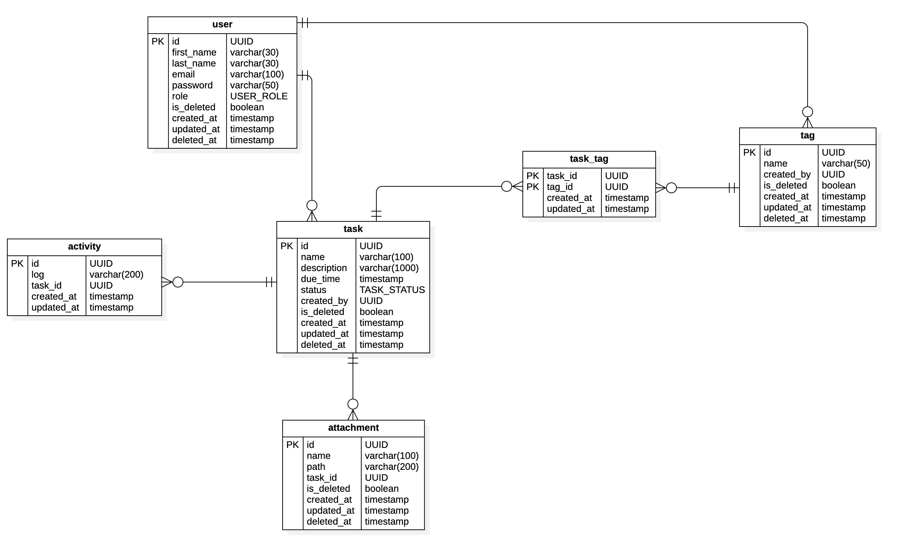

**Table of Contents**
- [Todo Apps](#todo-apps)
  - [Prerequisites](#prerequisites)
  - [Build and Run](#build-and-run)
    - [Instal dependencies:](#instal-dependencies)
    - [Build Project](#build-project)
    - [Deploy the app to your local machine](#deploy-the-app-to-your-local-machine)
    - [Migrate database](#migrate-database)
  - [Diagram](#diagram)
    - [Entity Replationship Diagram](#entity-replationship-diagram)
  - [API Documentation](#api-documentation)

## Prerequisites
In order to build and run this project, you have to install these tools:
  - [NodeJs](https://nodejs.org/en/) or [nvm](https://github.com/nvm-sh/nvm)
  - Docker and Docker Compose - the application will run in Docker
  - [FlywayDB](https://flywaydb.org/) - to run database migration
  
## Build and Run
After pulling the source code from repository, run these command to deploy the project to your local machine:
### Instal dependencies:
```console
npm install
```

### Build Project
```console
make build
```
Or
```console
npm run build
```
The above command will generate a `dist/` folder.

### Deploy the app to your local machine
```console
make run.dev
```
Or
```console
docker-compose -f docker-compose.dev.yml up
```

Now, the app should be run on port 8081 on your machine. Try to access: http://localhost:8081 to confirm your app run successfully.

### Migrate database
If you run this project for the first time, you have to generate database's schema, so let's run
```console
flyway -configFiles=./flyway.conf migrate
```

## Diagram
### Entity Replationship Diagram
<p></p>

## API Documentation